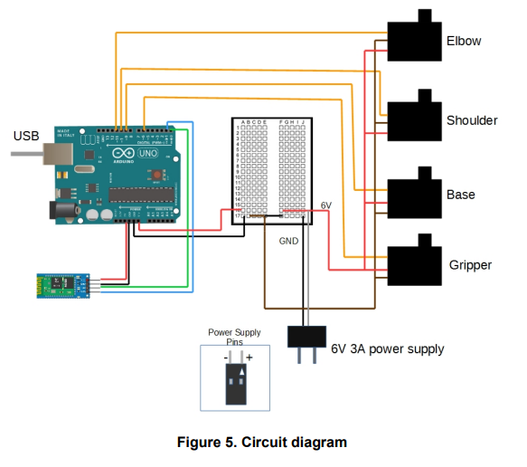

# Arduino-Bluetooth-Arm
Arduino Bluetooth Arm that utilizes an android application for movement using the MIT App Inventor Website.

## Codeblock

## Schematic Diagram

## Information
The 4 servo arms that will move the arm around needs a constant voltage of 5-6 volts, in my case I used a step down voltage regulator. 
